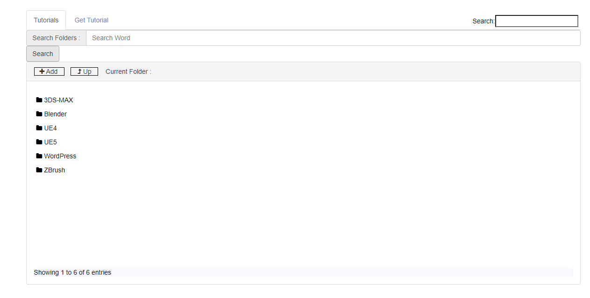

# Tutorial-server

`tutorial-server` Great tool to download, serve and control Youtube tutorials locally.
I developed this software for my own needs, but I wanted to share it with those who need it like me.
**_Warning: Only tested on Windows 10!_**

Original Author Credit: Sumit Chawla, David Dombrowsky

## Dependencies

You have to install ffmpeg (6+ full), nodejs v14 (npm 6.14+), python 3.11 and yt-dlp first.
All must be in your path !

## How to install

```sh
  git clone https://github.com/mdogancay/tutorial-server.git
  cd tutorial-server
  npm i
```

## Settings

Settings in `.env` file

## How to Run

```sh
  npm run serve
```

or

```sh
  node ./cli.js
```

You would see the message <b>Please open the link in your browser http://<YOUR-IP>:8088</b> in your console. Now you can point your browser to your IP.
For localhost access the files over http://127.0.0.1:8088

## ScreenShot


